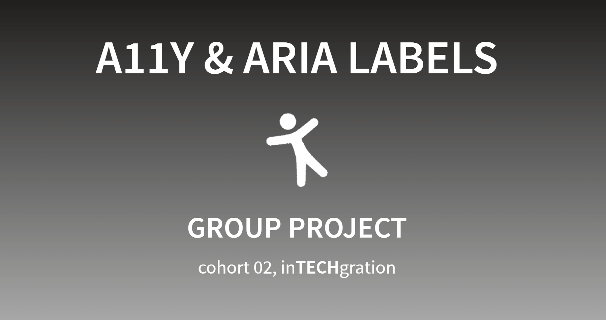

# Accessibility and ARIA Attributes Presentation

This repository contains a presentation on **Accessibility** (a11y) and **ARIA** (Accessible Rich Internet Applications) attributes.  

This presentation aims  
 to educate and raise awareness about **WHY** it's crucial to make web content accessible to everyone  
 to help developers understand **HOW** to ensure accessibility in web content for people with disabilities."

You can view the presentation online [here ↗️](https://in-tech-gration-cohort-0x02.github.io/Diving-into-Web-Accessibility/)

## Contributors
